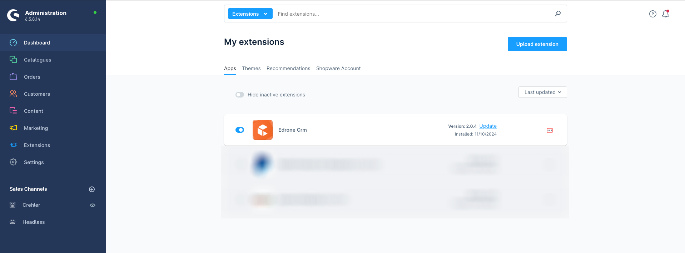
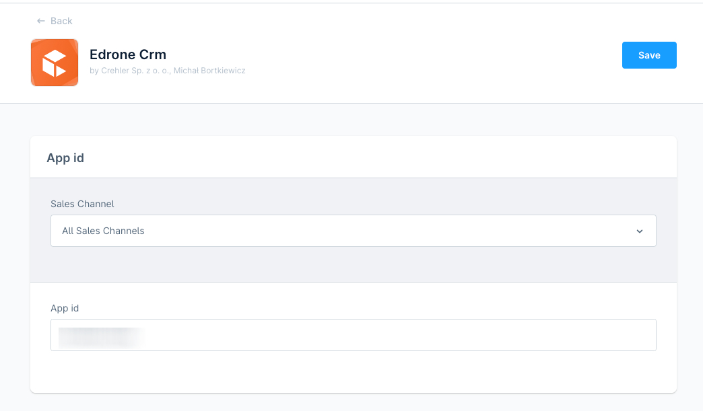
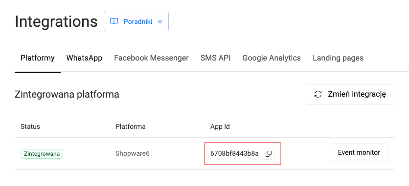

# CrehlerEdroneCRM

## Specification
- shopware 6.6.*
- php 8.2 or higher

## Installation

# Where to find App ID

# How it works
- User need to accept cookies on webstie to allow plugin sending data to edrone
# Reminder
- When user browser block additonal javascript plugins only orders and cancelation will be sent to edrone!

https://docs.edrone.me/#how-integration-works